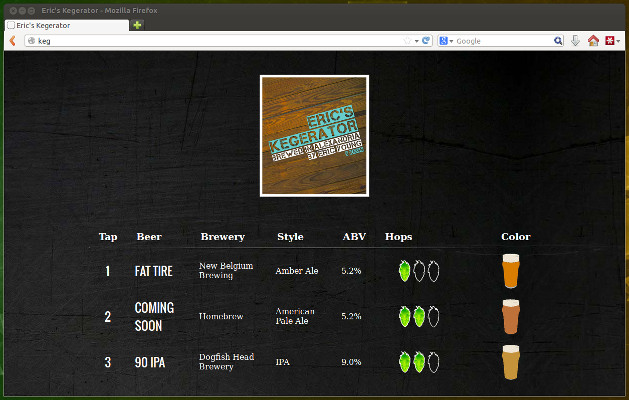

Inspired by the original Kegerface and Anddab87's forked project</a> I decided to make some adaptations for my kegerator.

Taking Anddav97's project (https://github.com/anddav87/hymaswoodkegerface) as a starting point, I stripped out the inventory and arduino aspects, leaving a kegerface that read data from a mysql database. I modified the mysql structure so that a 'Tap' number was associated with beers that were currently being served and modified the php so that only beers with a tap number showed in the interface.

As of now, the database muct be maipulated by hand (via cli or phpMyAdmin) but I may get around to adding a form at a later date.

read the INSTRUCTIONS.md file for installation instructions.

Screenshot(s):

Credits

a) Beer Labelizer: http://www.beerlabelizer.com

b) Kegerface Original: https://github.com/Kegerface/Kegerface

c) Anddab87's Kegerface Project: https://github.com/anddav87/hymaswoodkegerface

